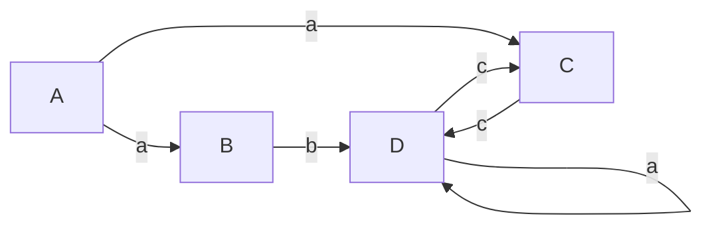
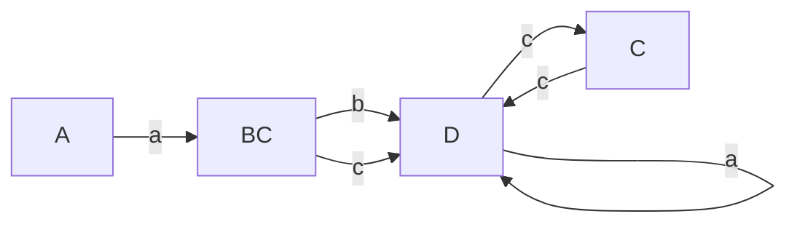
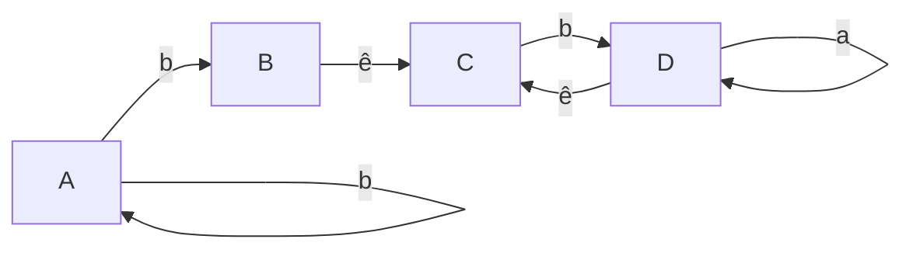
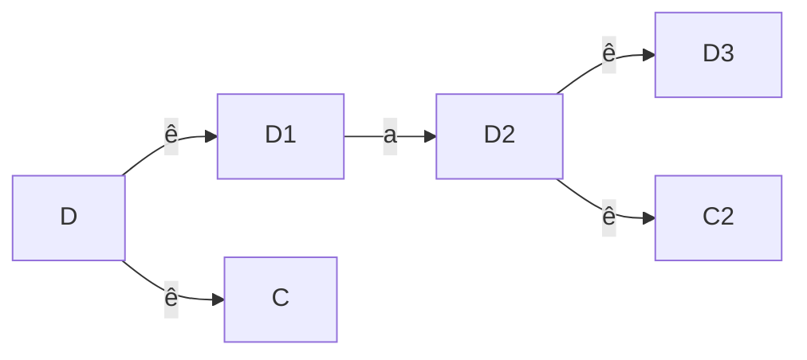
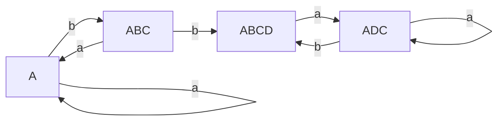

# Conversor AFNe e AFN para AFD

Programa em python para conversão e teste de AFN/AFNe

### AFN

$$
(A, a)\to B
$$
$$
(A, a)\to C
$$
$$
(B, b)\to D
$$
$$
(C, c)\to D
$$
$$
(D, a)\to D
$$
$$
(D, c)\to C
$$

Grafo de transições

Serão agregados todos os estados que consigo chegar a partir de um estado $X$ lendo $y$ qualquer, e então criado um novo estado.

Após a conversão da AFN para AFD.

Onde $D$ é um estado final.

---
### AFN-e

Transições:

$$
(A, a)\to A
$$
$$
(A, b)\to A
$$
$$
(A, b)\to B
$$
$$
(B, ê)\to C
$$
$$
(C, b)\to D
$$
$$
(D, a)\to D
$$
$$
(D, ê)\to C
$$
Grafo De Transições

Exemplo de conversão.

Então, pode-se dizer que $D \to DC$.

Tabela de transições

| #   | A   | ABC  | ABCD | ADC  |
| --- | --- | ---- | ---- | ---- |
| a   | A   | A    | ADC  | ADC  |
| b   | ABC | ABCD | ABCD | ABCD | 

Grafo Final

Onde $D$ é um estado final.